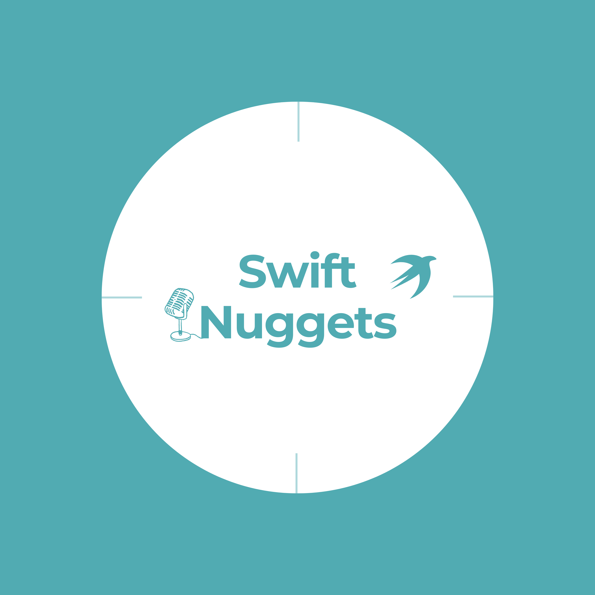

# Swift Nuggets

🎙️ **Welcome to Swift Nuggets!**

Hi, I'm Radu, your guide to everything Swift! In this podcast, we dive into the latest Swift proposals, explore new language features, and uncover tips to level up your coding skills. Whether you're a seasoned developer or just getting started, Swift Nuggets will keep you informed and ahead of the curve.

🎧 **Listen now**

- [YouTube](https://youtu.be/1y3vhQt7kEI?si=WDepBNEcFdl6DdS0)
- [Apple Podcasts](https://podcasts.apple.com/us/podcast/swift-nuggets/id1799279992)
- [Spotify](https://open.spotify.com/episode/0AAHerBKVBo0AkDLL0IfKC?si=FUGM3p-gSj2G792ePXxabw)

🚀 **Let's explore Swift, one nugget at a time!**

This repository contains links, code snippets, and resources featured in the "Swift Nuggets" podcast episodes.

## Episodes

### ⭐️ Episode #2 - April, 2025 - What's new in Swift 6.2? Future swift proposals

#### 🖇️ Resources

- [📝 Episode #2 Playground](episodes/S01E02%20-%20New%20in%20Swift%206.2/)
- [Xcode 16.3](https://developer.apple.com/documentation/xcode-release-notes/xcode-16_3-release-notes)
- [Swift Evolution Repo](https://github.com/swiftlang/swift-evolution)
- [Swift Changelog](https://github.com/swiftlang/swift/blob/main/CHANGELOG.md)
- [Swift 6.2 Release Process](https://forums.swift.org/t/swift-6-2-release-process/78371)
- [Swift Language focus areas heading into 2025](https://forums.swift.org/t/swift-language-focus-areas-heading-into-2025/76611/1)
- [Swift Evolution Process](https://github.com/swiftlang/swift-evolution/blob/main/process.md)

#### 🍔 What is new in Swift 6.2

**Presented already in Episode 1 👇**

- [SE-0446 - Nonescapable Types](https://github.com/swiftlang/swift-evolution/blob/main/proposals/0446-non-escapable.md)
- [SE-0447 - Span: Safe Access to Contiguous Storage](https://github.com/swiftlang/swift-evolution/blob/main/proposals/0447-span-access-shared-contiguous-storage.md)
- [SE-0451 - Raw identifiers](https://github.com/swiftlang/swift-evolution/blob/main/proposals/0451-escaped-identifiers.md)
- [SE-0452 - Integer Generic Parameters](https://github.com/swiftlang/swift-evolution/blob/main/proposals/0452-integer-generic-parameters.md)
- [SE-0453 - InlineArray, a fixed-size array](https://github.com/swiftlang/swift-evolution/blob/main/proposals/0453-vector.md)
- [SE-0458 - Opt-in Strict Memory Safety Checking](https://github.com/swiftlang/swift-evolution/blob/main/proposals/0458-strict-memory-safety.md)

**Presented in this episode 👇**
- [SE-0462 - Task Priority Escalation APIs](https://github.com/swiftlang/swift-evolution/blob/main/proposals/0462-task-priority-escalation-apis.md)
- [SE-0463 Import Objective-C completion handler parameters as @Sendable](https://github.com/swiftlang/swift-evolution/blob/main/proposals/0463-sendable-completion-handlers.md)
- [SE-0466 Control default actor isolation inference](https://github.com/swiftlang/swift-evolution/blob/main/proposals/0466-control-default-actor-isolation.md)
- [SE-0469 Task Naming](https://github.com/swiftlang/swift-evolution/blob/main/proposals/0469-task-names.md)
- [SE-0470 Global-actor isolated conformances](https://github.com/swiftlang/swift-evolution/blob/main/proposals/0470-isolated-conformances.md)

#### 🐹 Future Swift proposals

- [SE-0460 - Explicit Specialization](https://github.com/swiftlang/swift-evolution/blob/main/proposals/0460-specialized.md)
- [SE-0461 - Run nonisolated async functions on the caller's actor by default](https://github.com/swiftlang/swift-evolution/blob/main/proposals/0461-async-function-isolation.md)
- [SE-0464 - UTF8Span: Safe UTF-8 Processing Over Contiguous Bytes](https://github.com/swiftlang/swift-evolution/blob/main/proposals/0464-utf8span-safe-utf8-processing.md)
- [SE-0465 - Standard Library Primitives for Nonescapable Types](https://github.com/swiftlang/swift-evolution/blob/main/proposals/0465-nonescapable-stdlib-primitives.md)
- [SE-0467 - MutableSpan and MutableRawSpan: delegate mutations of contiguous memory](https://github.com/swiftlang/swift-evolution/blob/main/proposals/0467-MutableSpan.md)
- [SE-0468 - Hashable conformance for Async(Throwing)Stream.Continuation](https://github.com/swiftlang/swift-evolution/blob/main/proposals/0468-async-stream-continuation-hashable-conformance.md)
- [SE-0473 - Clock Epochs](https://github.com/swiftlang/swift-evolution/blob/main/proposals/0473-clock-epochs.md)

### ⭐️ Episode #1 - March, 2025 - What's new in Swift 6.1? Future Swift proposals

#### 🖇️ Resources

- [📝 Episode #1 Playground](episodes/S01E01%20-%20New%20in%20Swift%206.1/)
- [Xcode 16.3 beta 1](https://developer.apple.com/documentation/xcode-release-notes/xcode-16_3-release-notes)
- [Swift Evolution Repo](https://github.com/swiftlang/swift-evolution)
- [Swift Changelog](https://github.com/swiftlang/swift/blob/main/CHANGELOG.md)
- [Swift 6.1 Release Process](https://forums.swift.org/t/swift-6-1-release-process/75442)
- [Swift Language focus areas heading into 2025](https://forums.swift.org/t/swift-language-focus-areas-heading-into-2025/76611/1)
- [Swift Evolution Process](https://github.com/swiftlang/swift-evolution/blob/main/process.md)

#### 🍔 What is new in Swift 6.1

- [SE-0450 - Package traits](https://github.com/swiftlang/swift-evolution/blob/main/proposals/0450-swiftpm-package-traits.md)
- [SE-0439 - Allow trailing comma in comma-separated lists](https://github.com/swiftlang/swift-evolution/blob/main/proposals/0439-trailing-comma-lists.md)
- [SE-0444 - Member import visibility](https://github.com/swiftlang/swift-evolution/blob/main/proposals/0444-member-import-visibility.md)
- [SE-0445 - Improving `String.Index`'s printed descriptions](https://github.com/swiftlang/swift-evolution/blob/main/proposals/0445-string-index-printing.md)
- [SE-0443 - Precise Control Flags over Compiler Warnings](https://github.com/swiftlang/swift-evolution/blob/main/proposals/0443-warning-control-flags.md)
- [SE-0442 - Allow `TaskGroup`'s `ChildTaskResult` Type To Be Inferred](https://github.com/swiftlang/swift-evolution/blob/main/proposals/0442-allow-taskgroup-childtaskresult-type-to-be-inferred.md)
- [SE-0449 - Allow `nonisolated` to prevent global actor inference](https://github.com/swiftlang/swift-evolution/blob/main/proposals/0449-nonisolated-for-global-actor-cutoff.md)

#### 🐹 Future Swift proposals

- [SE-0448 - Regex lookbehind assertions](https://github.com/swiftlang/swift-evolution/blob/main/proposals/0448-regex-lookbehind-assertions.md)
- [SE-0451 - Raw identifiers](https://github.com/swiftlang/swift-evolution/blob/main/proposals/0451-escaped-identifiers.md)
- [SE-0452 - Integer Generic Parameters](https://github.com/swiftlang/swift-evolution/blob/main/proposals/0452-integer-generic-parameters.md)
- [SE-0453 - InlineArray, a fixed-size array](https://github.com/swiftlang/swift-evolution/blob/main/proposals/0453-vector.md)
- [SE-0446 - Nonescapable Types](https://github.com/swiftlang/swift-evolution/blob/main/proposals/0446-non-escapable.md)
- [SE-0458 - Opt-in Strict Memory Safety Checking](https://github.com/swiftlang/swift-evolution/blob/main/proposals/0458-strict-memory-safety.md)
- [SE-0447 - Span: Safe Access to Contiguous Storage](https://github.com/swiftlang/swift-evolution/blob/main/proposals/0447-span-access-shared-contiguous-storage.md)
- [SE-0456 - Add `Span`-providing Properties to Standard Library Types](https://github.com/swiftlang/swift-evolution/blob/main/proposals/0456-stdlib-span-properties.md)
- [SE-0455 - SwiftPM @testable build setting](https://github.com/swiftlang/swift-evolution/blob/main/proposals/0455-swiftpm-testable-build-setting.md)
- [SE-0459 - Add `Collection` conformances for `enumerated()`](https://github.com/swiftlang/swift-evolution/blob/main/proposals/0459-enumerated-collection.md)

#### 🕣 Reminder about Noncopyable

- [Article on whatsnewinswift.com about Noncopyable structs and enums](https://www.whatsnewinswift.com/?from=5.7&to=6.0#noncopyable-structs-and-enums)

## 🎵 Music Credits

The intro/outro music is licensed and titled "Hey Yo! feat. Macanache & Dash" by Carbon a.s. NarcoBranco.

© DigginRAWmania Society 2019 – All rights reserved. Listen here: https://linktr.ee/narcobranco.

## 🐼 Reach out to me

- [LinkedIn](https://www.linkedin.com/in/radu-dan-b0182349/)
- [YouTube](https://www.youtube.com/@radude89)
- [Website](https://www.radude89.com/)
